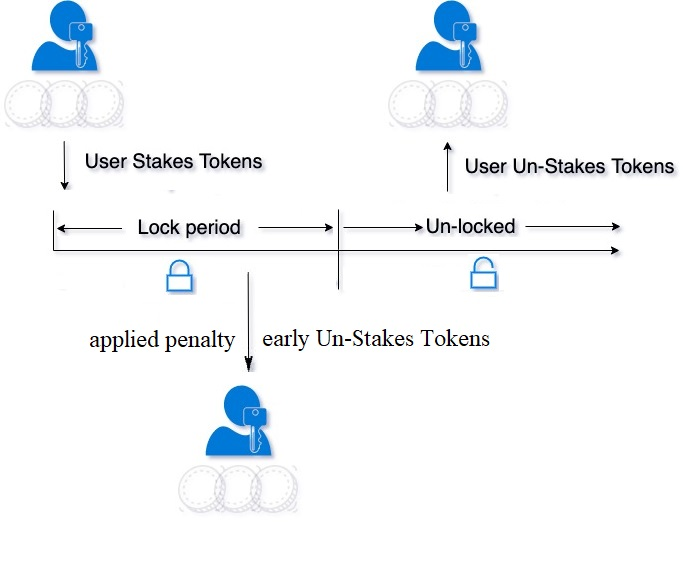

# Staking smart contract

ERC20 staking with **multiple admin-configurable plans**, **independent positions** per user, linear APR rewards, optional **early unstake** with **penalty on rewards only**, and **claim** / **unstake** flows.

## Architecture

- **`Staking.sol`** — main contract.
  - **`plans`**: `planId → { lockDuration, aprBps, active }`. Templates for **new** stakes only.
  - **`userPositions`**: `user → Position[]`. Each `stake()` appends one `Position` (no single balance per wallet).
  - **`Position`**: snapshots `lockDuration` and `aprBps` at stake time so `updatedPlan` does not retroactively change existing positions.
  - **`stakingToken`**: immutable ERC20 pulled via `transferFrom` on stake and paid out on claim/unstake.
  - **Access control**: `Ownable` for admin functions; `ReentrancyGuard` on state-changing user entrypoints.

Reward liability is covered by tokens already held by the contract (e.g. prefunded rewards or fees). The contract does not mint staking tokens.

## Diagram



## Reward formula

Rewards accrue linearly in time:

- **`aprBps`**: APR in basis points (e.g. `800` = 8% per year).
- **`BPS_DENOM`**: `10_000`.
- **`SECONDS_PER_YEAR`**: `365 days` (Solidity `365 days`).

`claimedRewards` records how much of that accrued stream has already been paid (via `claimRewards` or counted on `unstake`). **Pending** = lifetime accrued at `block.timestamp` minus `claimedRewards`.

## Key assumptions

1. **Staking token** is a standard ERC20; amounts use token decimals (no USD oracle).
2. **Contract must hold enough tokens** to pay rewards; rewards are not minted.
3. **Early unstake**: user always receives **full principal**; **pending rewards** are multiplied by \((1 - \text{penaltyBps}/10{,}000)\). Penalty **forfeiture** stays in the contract.
4. **`claimRewards` while locked** pays **full** pending rewards (penalty applies on **`unstake`**, not on claim). Adjust in code if product should forbid mid-lock claims.
5. **Plan changes** after stake do not alter snapshot fields on open positions.
6. Rounding favors the protocol (integer division).

## Admin functions

- `addedPlan(lockDuration, aprBps)` — new plan, `active = true`.
- `updatedPlan(planId, lockDuration, aprBps)` — change APR and lock duration for **new** stakes (existing positions keep snapshots).
- `activatedPlan(planId, active)` — enable or disable accepting new stakes into that plan.
- `setEarlyUnstakePenaltyBps(penaltyBps)` — max `10_000` (100% of pending rewards).

## User functions

- `stake(planId, amount)`
- `claimRewards(positionIndex)` — claim without unstaking.
- `unstake(positionIndex)` — principal + rewards (penalty on rewards if still locked).

## View helpers

Includes `getPlan`, `getUserPosition`, `getUserPositionCount`, `pendingRewards`, `totalAccruedRewards`, `claimedRewardsOf`, `positionPrincipal`, `positionAprBps`, `positionLockDuration`, `positionStakeStart`, `isPositionClosed`, `isPositionLocked`, `positionLockEnd`, `secondsUntilUnlock`, `stakingDurationElapsed`, `previewUnstakeReward`, `previewClaimableRewards`, `isPlanActive`, `contractTokenBalance`, `totalOpenPrincipal`, plus public immutables/constants and `plans` / `planCount` / `userPositions` / `earlyUnstakePenaltyBps`.

## How to deploy

This project deploys `Staking` behind a **UUPS proxy**. You interact with the **proxy address**; the implementation (logic) can be upgraded later by the owner.

**Initializer:** `initialize(IERC20 stakingTokenAddress, address owner)` — `owner` receives admin rights (`addedPlan`, `updatedPlan`, `activedPlan`, etc.).

### Hardhat script (`scripts/deploy.js`)

1. `npm install` and `npm run compile`
2. Run on a network Hardhat knows about (see `hardhat.config.js`).

**Local (in-memory):** deploys `MockERC20` automatically if `STAKING_TOKEN` is not set, then deploys `Staking`.

```bash
npm run deploy
```

**Local persistent node:** start `npx hardhat node` in one terminal, then:

```bash
npx hardhat run scripts/deploy.js --network localhost
```

### Sepolia testnet

1. Copy `.env.example` to `.env` and set:
   - **`SEPOLIA_RPC_URL`** — Alchemy, Infura, or another Sepolia HTTPS endpoint.
   - **`PRIVATE_KEY`** — deployer wallet (fund it with Sepolia ETH from a [faucet](https://sepoliafaucet.com/) or search “Sepolia faucet”).
   - **`STAKING_TOKEN`** — address of an **ERC20 already deployed on Sepolia** (the script does not auto-deploy a mock on testnet).
   - **`STAKING_OWNER`** (optional) — defaults to the deployer address.
   - **`ETHERSCAN_API_KEY`** (optional but recommended) — for verifying the implementation on Etherscan.

2. Deploy:

```bash
npm run deploy:sepolia
```

Equivalent: `npx hardhat run scripts/deploy.js --network sepolia`.

**Other testnets / mainnet:** add a `networks` entry in `hardhat.config.js` (mirror the `sepolia` block) and run with `--network <name>`. Never commit `.env` or keys.

**After deploy**

- Save the **proxy address** printed by the script. That is the address you use in your UI and for admin calls.
- Send enough of the **same** ERC20 to the `Staking` contract so it can pay rewards (the contract does not mint).
- As `owner`, call `addedPlan`, `setEarlyUnstakePenaltyBps`, etc.

#### MockERC20 on Sepolia Etherscan (share this link)

https://sepolia.etherscan.io/address/0x71A8e20013E341B30AA60F60146Da4692319B23a

#### Staking proxy (dApp / integrations use this) (share this link)

https://sepolia.etherscan.io/address/0x0A651822fe1e678fBAA3a5c8b50AAcA285C6A6df

#### Staking implementation (logic contract) (share this link)

https://sepolia.etherscan.io/address/0xD11263722A4F3092d432D445F2579d25008D7C57


#### subgraph url 
https://thegraph.com/studio/subgraph/staking/endpoints


### How to upgrade later (UUPS)

1. Implement your changes in `contracts/Staking.sol` (keep storage layout compatible).
2. Put the deployed proxy address into `.env` as `STAKING_PROXY`.
3. Upgrade on Sepolia:

```bash
npm run upgrade:sepolia
```

### Remix / other tools

For upgradeable deployments, prefer Hardhat + OpenZeppelin upgrades. If you deploy without a proxy, you lose upgradeability.

## How to test

```bash
npm install
npm test
```

Uses Hardhat and `@nomicfoundation/hardhat-toolbox` against `MockERC20` + `Staking`.

## Repository layout

- `contracts/Staking.sol` — staking logic
- `contracts/MockERC20.sol` — test token
- `test/Staking.test.js` — tests
- `hardhat.config.js` — Solidity 0.8.24, optimizer on

`.gitignore` ignores `node_modules`, `artifacts`, `cache`, env files, and common IDE noise.
